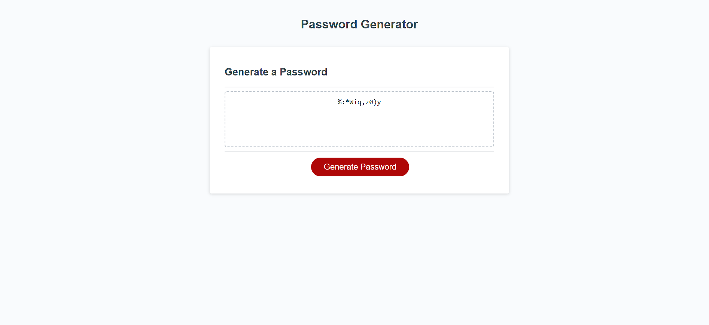

# Javascript-password-generator
## deployed link
https://gmoney3303.github.io/Javascript-password-generator/

## Description

this project randomly generates passwords that meet criteria of the users choosing.
throughout this project I learned how to use ai to help me the student ai learning assistant helps me figure out how to right new ligns of code.
like parse int.

## Usage

## Credits

List your collaborators, if any, with links to their GitHub profiles.

If you used any third-party assets that require attribution, list the creators with links to their primary web presence in this section.

If you followed tutorials, include links to those here as well.

## Features

project can generate a random password meet with criteria that the user chooses
